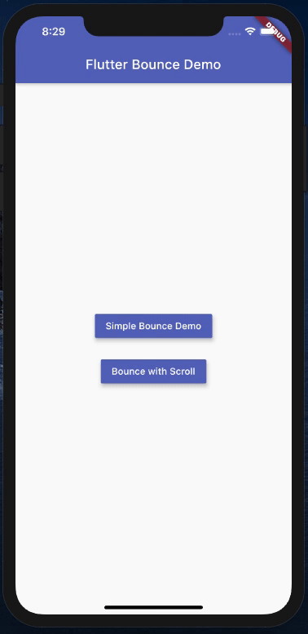
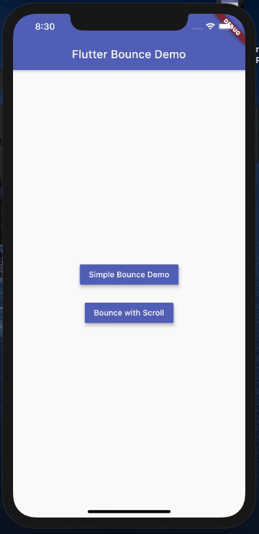

# flutter_bounce

[](https://pub.dev/packages/flutter_bounce)
[](https://github.com/aloklearning/flutter_bounce/blob/master/LICENSE)
[](https://pub.dev/packages/flutter_bounce#-analysis-tab-)

- An efficient flutter package for an **on-tap bounce** animation on any flutter widgets 
- This package is an enhanced version of [bouncing_widget](https://pub.dev/packages/bouncing_widget).
- **Limitation** of the **bouncing_widget** package: 
    - It is not efficient for the widgets in Scroll Pages. We cannot scroll while having our fingers on the widget
    - The same issue would be found [here](https://github.com/ThomasEcalle/bouncing_widget/issues/1)


## Advantages of flutter_bounce

- Flutter bounce package will give you full freedom, to be used in on both the **static** and **dynamic like scrolling pages**.
- Not sticky on scrolling, efficient bounce effect every where
- With **Duration**, controll the bounce animation
- It doesn't let the widget stay pressed when you scroll through, if we use the normal bounce effect with simply using the `Flutter AnimationController` and `Tranform.scale()` Widget. 

## Disclaimer

- Widget `flutter_widget` is not the copy paste of `bouncing_widget`, it works differently. Without limitations, and the functionality works differently, based upon the `duration`, and not on the `scaleFactor`. 
- It doesn't have the `scaleFactor` at all, which is required in the widget
- The code written in such a way that supports the `flutter_bounce` functionality. However, I have taken motivation from the limitations of the `bouncing_widget`

## Usage

To use this plugin, add `flutter_bounce` as a [dependency in your pubspec.yaml file](https://flutter.dev/docs/development/packages-and-plugins/using-packages).

## Demo

This is how the `Bounce` Widget works when wrapped around the widget. The below shows `Bounce` being used in both the scenario:
1. Static Page with Duration set facility
2. Scroll Page with default Duration as 100 ms:
    - Horizontal Scroll
    - Vertical Scroll




## Example

- Import the library

```dart
import 'package:flutter_bounce/flutter_bounce.dart';
```

- In order to use this package, we just need to wrap the content with the widget `Bounce`.
- `child`, `duration` and `onPressed` is mandatory in the widget. 
- However, `onPressed` and `duration` can have `null` in the widget. By default `duration` is set to `100 milliseconds`.
- **Please Note:** Always pass the duration in `milliseconds` for best result

```dart
Bounce(
  duration: Duration(milliseconds: 110),
  onPressed: (){ YOUR_FUNCTION },
  child: YOUR_WIDGET
)
```

## Acknowledgement

- I would like to thank [Levent Kantaroğlu](https://github.com/leventkantaroglu) for contributing in the recent **null safety** addition to the code, which will now help the community to use this package efficiently.
- I would like to thank [ThomasEcalle](https://github.com/ThomasEcalle) for the indirect motivation via his widget, to come up with an efficient work around, which will now be useful for our flutter community people


